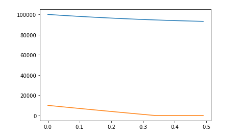
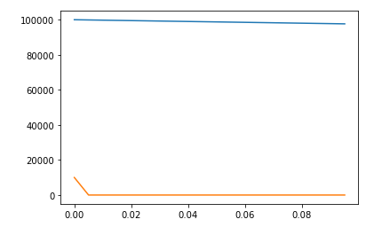

---
# Front matter
lang: ru-RU
title: "Отчёт по лабораторной работе"
subtitle: "Лабораторная №3"
author: "Чупрына Петр Петрович"

# Formatting
toc-title: "Содержание"
toc: true # Table of contents
toc_depth: 2
lof: true # List of figures
lot: true # List of tables
fontsize: 12pt
linestretch: 1.5
papersize: a4paper
documentclass: scrreprt
polyglossia-lang: russian
polyglossia-otherlangs: english
mainfont: PT Serif
romanfont: PT Serif
sansfont: PT Sans
monofont: PT Mono
mainfontoptions: Ligatures=TeX
romanfontoptions: Ligatures=TeX
sansfontoptions: Ligatures=TeX,Scale=MatchLowercase
monofontoptions: Scale=MatchLowercase
indent: true
pdf-engine: lualatex
header-includes:
  - \usepackage{lmodern}
  - \linepenalty=10 # the penalty added to the badness of each line within a paragraph (no associated penalty node) Increasing the value makes tex try to have fewer lines in the paragraph.
  - \interlinepenalty=0 # value of the penalty (node) added after each line of a paragraph.
  - \hyphenpenalty=50 # the penalty for line breaking at an automatically inserted hyphen
  - \exhyphenpenalty=50 # the penalty for line breaking at an explicit hyphen
  - \binoppenalty=700 # the penalty for breaking a line at a binary operator
  - \relpenalty=500 # the penalty for breaking a line at a relation
  - \clubpenalty=150 # extra penalty for breaking after first line of a paragraph
  - \widowpenalty=150 # extra penalty for breaking before last line of a paragraph
  - \displaywidowpenalty=50 # extra penalty for breaking before last line before a display math
  - \brokenpenalty=100 # extra penalty for page breaking after a hyphenated line
  - \predisplaypenalty=10000 # penalty for breaking before a display
  - \postdisplaypenalty=0 # penalty for breaking after a display
  - \floatingpenalty = 20000 # penalty for splitting an insertion (can only be split footnote in standard LaTeX)
  - \raggedbottom # or \flushbottom
  - \usepackage{float} # keep figures where there are in the text
  - \floatplacement{figure}{H} # keep figures where there are in the text
---

# Цель работы

Рассмотреть модели боевых действий - модели ланчестера.

# Задание

Между страной Х и страной У идет война.
Численность состава войск исчисляется от начала войны, и являются временными функциями $x(t)$ и $y(t)$.
В начальный момент времени страна $Х$ имеет армию численностью $100000$ человек,а в распоряжении страны $У$ армия численностью в $10000$ человек.
Для упрощения модели считаем, что коэффициенты $a, b, c, h$ постоянны. Также считаем $P(t) и $Q(t)$ непрерывными функциями.  

Необходимо построить графики изменения численности войск армии Х и армии У для следующих случаев:

1.  Модель боевых действий между регулярными войсками.

$\frac{dx}{dt}=-a(t)x(t)-b(t)y(t)+P(t)$  
$\frac{dy}{dt}=-c(t)x(t)-h(t)y(t)+Q(t)$

Где a = 0.12, b=0.9, c=0.3, h=0.1, P(t)=|sin(t)|, Q(t)=|cos(t)|

2.  Модель ведения боевых действий с участием регулярных войск и
партизанских отрядов

$\frac{dx}{dt}=-a(t)x(t)-b(t)y(t)+P(t)$  
$\frac{dy}{dt}=-c(t)x(t)y(t)-h(t)y(t)+Q(t)$

Где a = 0.25, b=0.96, c=0.25, h=0.3, P(t)= sin(2*t)+1, Q(t)= cos(20*t)+1

## Первая модель

На рис. -@fig:003 показан график изменения численности армий в первой модели

{#fig:003 width=70%}

В момент времени t = 0.35 армия $X$ уничтожила армию $Y$.

## Вторая модель

На рис. -@fig:004 показан график изменения численности армий во второй модели

{#fig:004 width=70%}

В момент времени t = 0.005 армия $X$ уничтожила армию $Y$.

# Вывод

Я научился решать системы дифференциальных уравнений на языке python и проанализировал модели боевых действий