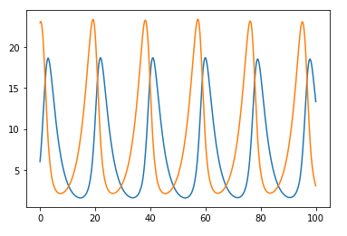
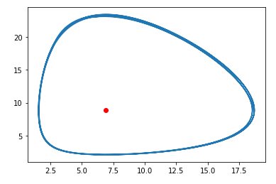

---
# Front matter
lang: ru-RU
title: "Отчёт по лабораторной работе"
subtitle: "Лабораторная №5"
author: "Чупрына Петр Петрович"

# Formatting
toc-title: "Содержание"
toc: true # Table of contents
toc_depth: 2
lof: true # List of figures
lot: true # List of tables
fontsize: 12pt
linestretch: 1.5
papersize: a4paper
documentclass: scrreprt
polyglossia-lang: russian
polyglossia-otherlangs: english
mainfont: PT Serif
romanfont: PT Serif
sansfont: PT Sans
monofont: PT Mono
mainfontoptions: Ligatures=TeX
romanfontoptions: Ligatures=TeX
sansfontoptions: Ligatures=TeX,Scale=MatchLowercase
monofontoptions: Scale=MatchLowercase
indent: true
pdf-engine: lualatex
header-includes:
  - \usepackage{lmodern}
  - \linepenalty=10 # the penalty added to the badness of each line within a paragraph (no associated penalty node) Increasing the value makes tex try to have fewer lines in the paragraph.
  - \interlinepenalty=0 # value of the penalty (node) added after each line of a paragraph.
  - \hyphenpenalty=50 # the penalty for line breaking at an automatically inserted hyphen
  - \exhyphenpenalty=50 # the penalty for line breaking at an explicit hyphen
  - \binoppenalty=700 # the penalty for breaking a line at a binary operator
  - \relpenalty=500 # the penalty for breaking a line at a relation
  - \clubpenalty=150 # extra penalty for breaking after first line of a paragraph
  - \widowpenalty=150 # extra penalty for breaking before last line of a paragraph
  - \displaywidowpenalty=50 # extra penalty for breaking before last line before a display math
  - \brokenpenalty=100 # extra penalty for page breaking after a hyphenated line
  - \predisplaypenalty=10000 # penalty for breaking before a display
  - \postdisplaypenalty=0 # penalty for breaking after a display
  - \floatingpenalty = 20000 # penalty for splitting an insertion (can only be split footnote in standard LaTeX)
  - \raggedbottom # or \flushbottom
  - \usepackage{float} # keep figures where there are in the text
  - \floatplacement{figure}{H} # keep figures where there are in the text
---

# Цель работы

Рассмотреть модель взаимодействия двух видов типа «хищник — жертва» - модель Лотки-Вольтерры.

# Задание

Для модели «хищник-жертва»:

$\begin{cases} \frac{dx}{dt}=-ax(t)+bx(t)y(t)\\\frac{dy}{dt}=cy(t)-dx(t)y(t) \end{cases}$

Построить график зависимости численности хищников от численности жертв, а также графики изменения численности
хищников и численности жертв при следующих начальных условиях: $x_{0}=6, y_{0}=11$. Найти стационарное состояние системы.
Значения коэффициентов: a=0.12, b=0.041, c=0.32, d=0.029

## Изменение численности хищников и жертв

На рис. -@fig:001 показан график изменения численности хищников и жертв с течением времени

{#fig:001 width=70%}

Как видно из рисунка, популяции циклически увеличиваются и уменьшаются одна за другой.

## Зависимость численности хищников от численности жертв.

На рис. -@fig:002 показан график зависимости численности хищников от численности жертв. Как видно из
рисунка, цикл не статический, с каждым оборотом амплитуда увеличивается, то есть максимальное количество особей
на каждом новом шаге становится больше, а минимальное количество меньше.

{#fig:002 width=70%}

## Стационарное состояние системы.

На рис. -@fig:003 показан график стационарного состояния системы, то есть при каждом новом обороте цикла общее
количество особей сохраняется. Это положение системы достигается при $x_{0}=c/d, y_{0}=a/b$.

{#fig:004 width=70%}

# Вывод

Я построил и проанализировал модель взаимодействия двух видов типа «хищник — жертва».