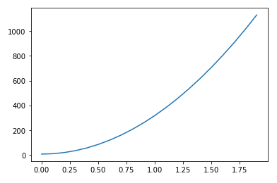
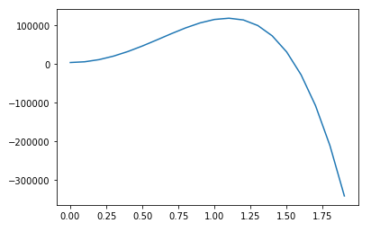
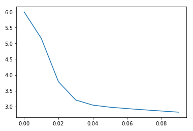

---
# Front matter
lang: ru-RU
title: "Отчёт по лабораторной работе"
subtitle: "Лабораторная №7"
author: "Чупрына Петр Петрович"

# Formatting
toc-title: "Содержание"
toc: true # Table of contents
toc_depth: 2
lof: true # List of figures
lot: true # List of tables
fontsize: 12pt
linestretch: 1.5
papersize: a4paper
documentclass: scrreprt
polyglossia-lang: russian
polyglossia-otherlangs: english
mainfont: PT Serif
romanfont: PT Serif
sansfont: PT Sans
monofont: PT Mono
mainfontoptions: Ligatures=TeX
romanfontoptions: Ligatures=TeX
sansfontoptions: Ligatures=TeX,Scale=MatchLowercase
monofontoptions: Scale=MatchLowercase
indent: true
pdf-engine: lualatex
header-includes:
  - \usepackage{lmodern}
  - \linepenalty=10 # the penalty added to the badness of each line within a paragraph (no associated penalty node) Increasing the value makes tex try to have fewer lines in the paragraph.
  - \interlinepenalty=0 # value of the penalty (node) added after each line of a paragraph.
  - \hyphenpenalty=50 # the penalty for line breaking at an automatically inserted hyphen
  - \exhyphenpenalty=50 # the penalty for line breaking at an explicit hyphen
  - \binoppenalty=700 # the penalty for breaking a line at a binary operator
  - \relpenalty=500 # the penalty for breaking a line at a relation
  - \clubpenalty=150 # extra penalty for breaking after first line of a paragraph
  - \widowpenalty=150 # extra penalty for breaking before last line of a paragraph
  - \displaywidowpenalty=50 # extra penalty for breaking before last line before a display math
  - \brokenpenalty=100 # extra penalty for page breaking after a hyphenated line
  - \predisplaypenalty=10000 # penalty for breaking before a display
  - \postdisplaypenalty=0 # penalty for breaking after a display
  - \floatingpenalty = 20000 # penalty for splitting an insertion (can only be split footnote in standard LaTeX)
  - \raggedbottom # or \flushbottom
  - \usepackage{float} # keep figures where there are in the text
  - \floatplacement{figure}{H} # keep figures where there are in the text
---

# Цель работы

Изучить модель эффективности рекламы

# Задание

1.	Изучить модель эфеективности рекламы
2.	Построить графики распространения рекламы в заданных случайх
3.	Определить для случая 2 момент времени, в который скорость распространения рекламы будет максимальной

## Задача

Постройте график распространения рекламы, математическая модель которой описывается следующим уравнением:

1.	$\frac{dn}{dt} = (0.82 + 0.00003n(t))(N-n(t))$
2.	$\frac{dn}{dt} = (0.00003 + 0.82n(t))(N-n(t))$
3.	$\frac{dn}{dt} = (0.2*sin(t) + 0.8*cos(t)n(t))(N-n(t))$

При этом объем аудитории $N = 761$, в начальный момент о товаре знает 6 человек.

Для случая 2 определите в какой момент времени скорость распространения рекламы будет иметь максимальное значение.

{ #fig:003 width=70% height=70% }

{ #fig:004 width=70% height=70% }

максимальная скорость распространения достигается при $t=2$

{ #fig:005 width=70% height=70% }

{ #fig:006 width=70% height=70% }

# Выводы
В ходе выполнения лабораторной работы была изучена модель эффективности рекламы и построены графики.